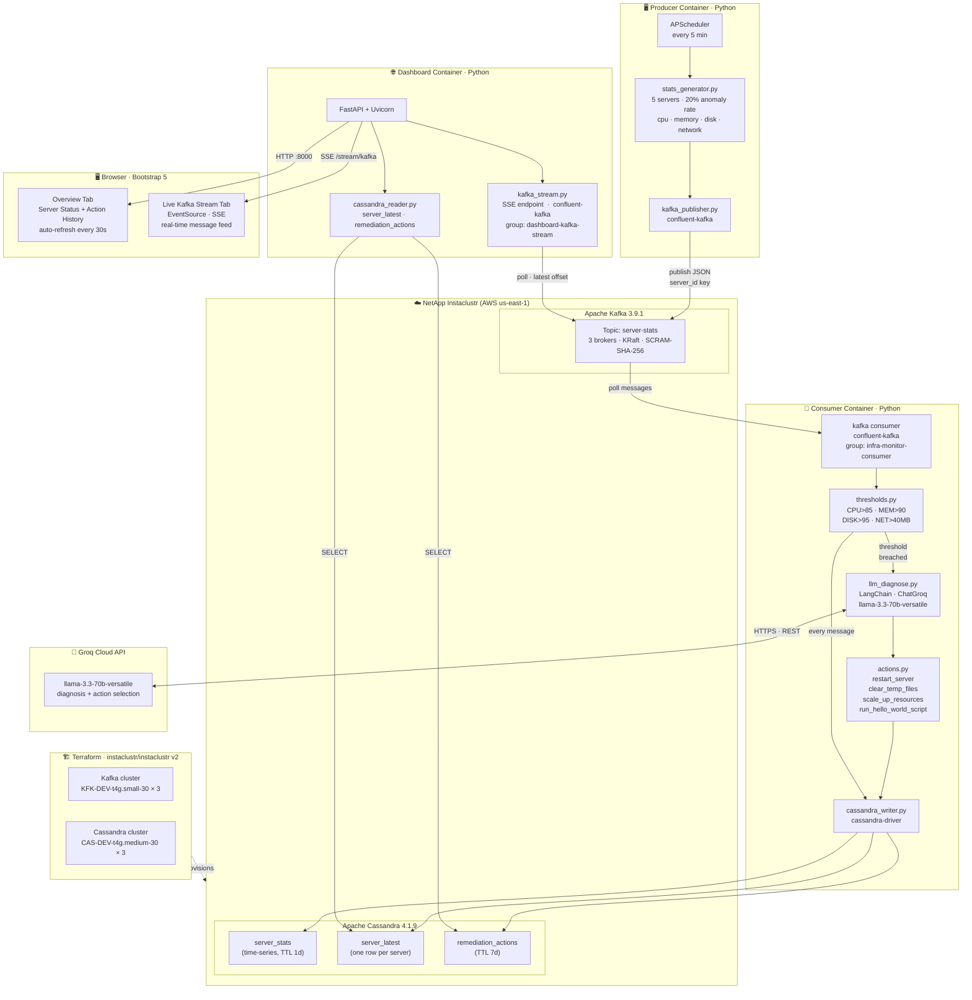

# Infra Monitor — AI-Powered Infrastructure Monitoring PoC

A proof-of-concept that combines **NetApp Instacluster** (Kafka + Cassandra), **LangChain + Groq LLM**, and a **FastAPI dashboard** to simulate infrastructure monitoring and AI-driven remediation.

## Architecture



| Component | Powered by |
|-----------|-----------|
| **Producer** | Python · APScheduler · confluent-kafka |
| **Message bus** | Apache Kafka 3.9.1 (NetApp Instaclustr) · SCRAM-SHA-256 |
| **AI diagnosis** | LangChain · Groq API · llama-3.3-70b-versatile |
| **Persistence** | Apache Cassandra 4.1.9 (NetApp Instaclustr) · cassandra-driver |
| **Dashboard** | FastAPI · Jinja2 · Bootstrap 5 · Server-Sent Events |
| **Infrastructure** | Terraform · instaclustr/instaclustr provider v2 |

---

## Prerequisites

- Docker + Docker Compose
- Terraform >= 1.3
- NetApp Instacluster account with API credentials
- Groq API key (free tier: https://console.groq.com)

---

## Setup

### 1. Provision Infrastructure with Terraform

```bash
cd terraform
cp terraform.tfvars.example terraform.tfvars
# Edit terraform.tfvars with your Instacluster credentials
terraform init
terraform apply
```

Note the outputs — you will need them for the `.env` file.

### 2. Configure Environment

```bash
cp .env.example .env
# Fill in values from terraform output and your Groq API key
```

Key variables:

| Variable | Source |
|---|---|
| `GROQ_API_KEY` | console.groq.com |
| `KAFKA_BOOTSTRAP_SERVERS` | `terraform output kafka_bootstrap_servers` |
| `KAFKA_SASL_USERNAME` | `terraform output -raw kafka_sasl_username` |
| `KAFKA_SASL_PASSWORD` | `terraform output -raw kafka_sasl_password` |
| `CASSANDRA_CONTACT_POINTS` | `terraform output cassandra_contact_points` |
| `CASSANDRA_USERNAME` | `terraform output -raw cassandra_username` |
| `CASSANDRA_PASSWORD` | `terraform output -raw cassandra_password` |

### 3. Run with Docker Compose

```bash
docker-compose up --build
```

- Dashboard: http://localhost:8000
- Producer publishes stats immediately on startup, then every 5 minutes
- Consumer processes messages in real-time; LLM is invoked only when thresholds are breached

---

## Anomaly Thresholds

| Metric | Threshold | LLM-chosen action |
|--------|-----------|-------------------|
| CPU | > 85% | `restart_server` or `scale_up_resources` |
| Memory | > 90% | `clear_temp_files` or `restart_server` |
| Disk | > 95% | `clear_temp_files` |
| Network In | > 40 MB/sample | `run_hello_world_script` or `scale_up_resources` |

---

## Simulated Servers

| Server | Role |
|--------|------|
| web-01, web-02 | Web servers |
| db-01, db-02 | Database servers |
| cache-01 | Cache / Redis-like server |

Each server has a 20% probability of anomaly injection per 5-minute run.

---

## Project Structure

```
Auto-Provisioning-instacluster/
├── terraform/          # NetApp Instacluster provisioning (Kafka + Cassandra)
├── producer/           # Fake stats generator + Kafka publisher
├── consumer/           # LangChain + Groq LLM consumer + Cassandra writer
├── dashboard/          # FastAPI web dashboard
├── docker-compose.yml
├── .env.example
└── README.md
```

---

## Development Tips

- Lower `SERVER_POLL_INTERVAL_SECONDS=30` in `.env` to see data faster without waiting 5 minutes.
- Temporarily lower thresholds in `consumer/thresholds.py` (e.g. `CPU_THRESHOLD = 10.0`) to force LLM calls without a real anomaly.
- Run modules individually for easier debugging:

```bash
# Terminal 1
cd producer && pip install -r requirements.txt && python main.py

# Terminal 2
cd consumer && pip install -r requirements.txt && python main.py

# Terminal 3
cd dashboard && pip install -r requirements.txt && uvicorn main:app --reload --port 8000
```
